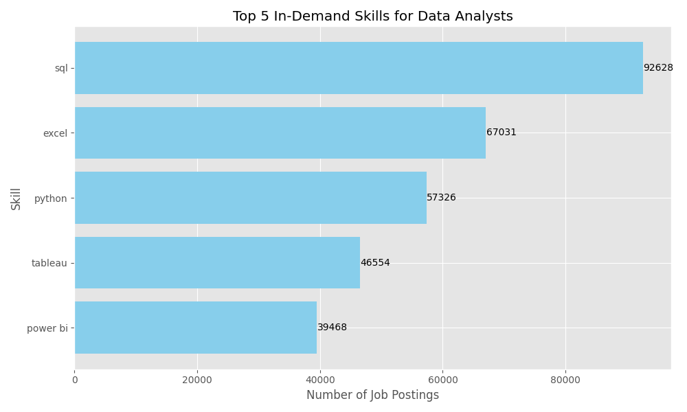
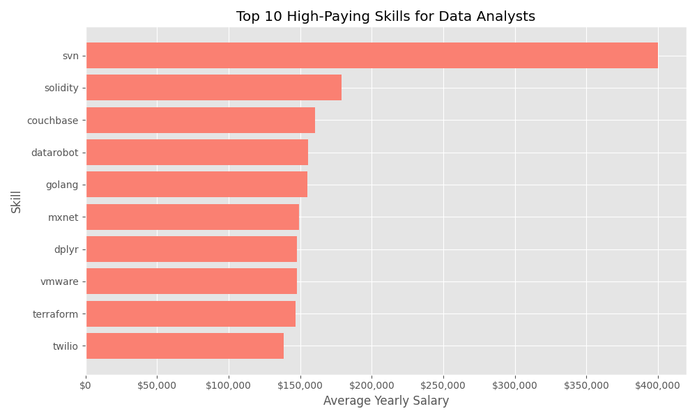
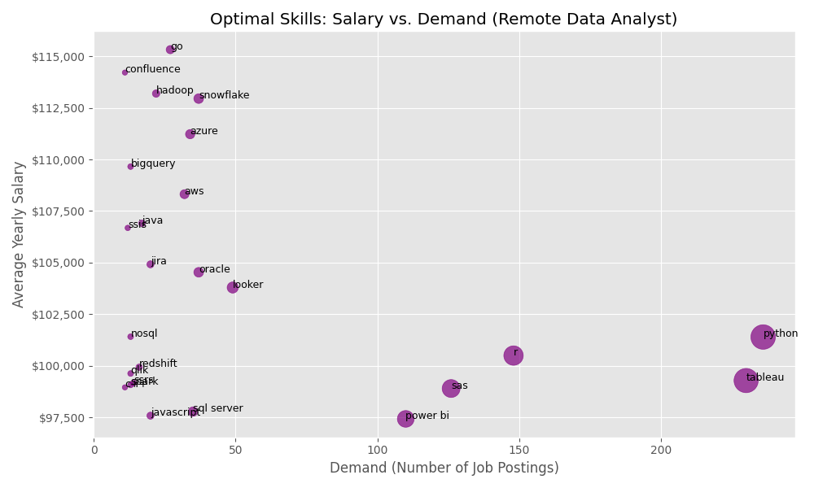

# Data Analyst Job Market Analysis

## 1. Introduction
This project focuses on analyzing the Data Analyst job market to identify top-paying roles, in-demand skills, and the optimal skills for career growth. By leveraging SQL, I have extracted insights from a dataset of job postings to help guide aspiring and established Data Analysts.

## 2. Background
Understanding the job market is crucial for anyone looking to advance their career. This project aims to answer key questions such as:
- What are the highest-paying Data Analyst jobs?
- What skills are most in demand?
- Which skills offer the best balance of high demand and high salary?

## 3. Tools Used
- **SQL**: Used for data querying, transformation, and analysis.
- **PostgreSQL**: The database management system used for storing and querying the job postings data.
- **VS Code**: The integrated development environment (IDE) for writing and executing SQL queries.
- **Git & GitHub**: Used for version control and sharing the project.

## 4. The Analysis

### 1. Top Paying Data Analyst Jobs
This analysis identifies the top 10 highest-paying Data Analyst roles that are available remotely.
- **Analysis**: Filters for 'Data Analyst' roles, 'Anywhere' location, and 'Full-time' schedule.
- **SQL Query**: [1_top_paying_jobs.sql](Project_sql/1_top_paying_jobs.sql)

```sql
SELECT
    job_id,
    job_title,
    salary_year_avg,
    name AS company_name
FROM 
    job_postings_fact 
LEFT JOIN 
    company_dim ON job_postings_fact.company_id = company_dim.company_id
WHERE 
    job_title_short = 'Data Analyst' AND salary_year_avg is not null AND
    job_location = 'Anywhere' AND
    job_schedule_type = 'Full-time' 
ORDER BY
    salary_year_avg DESC
LIMIT 10;
```

### 2. Skills for Top Paying Jobs
This query finds the specific skills required for the top 10 highest-paying jobs identified in the previous step.
- **Analysis**: Joins the top 10 jobs with the skills table to list required skills.
- **SQL Query**: [2_top_paying_jobs.sql](Project_sql/2_top_paying_jobs.sql)

### 3. Most In-Demand Skills
Identifies the top 5 most frequent skills requested in Data Analyst job postings.
- **Analysis**: 
    - **SQL** is the most requested skill, appearing in over 92,000 job postings. This underscores the critical importance of database management and querying for data analysts.
    - **Excel** follows, highlighting the continued reliance on spreadsheets for data manipulation.
    - **Python** is the leading programming language, essential for advanced analytics and automation.
    - **Visualization Tools**: Tableau and Power BI are also highly sought after, emphasizing the need for data presentation skills.
- **Visual**:

- **SQL Query**: [3_top_paying_jobs.sql](Project_sql/3_top_paying_jobs.sql)

### 4. Top Paying Skills
Determines which skills are associated with the highest average salaries for Data Analysts.
- **Analysis**: 
    - High-paying skills are often niche or specialized. 
    - Skills related to big data, blockchain (e.g., Solidity), or specific database technologies typically command higher salaries due to the specialized knowledge required and lower supply of qualified professionals.
- **Visual**:

- **SQL Query**: [4_top_paying_jobs.sql](Project_sql/4_top_paying_jobs.sql)

### 5. Optimal Skills (High Demand & High Salary)
identifies the "sweet spot" skills that are both in high demand and command high salaries (specifically for remote roles).
- **Analysis**: 
    - **Cloud & Big Data**: Technologies like **Snowflake**, **Hadoop**, **Azure**, and **AWS** appear frequently in the optimal zone, offering salaries above $100k with decent demand.
    - **Programming**: Languages like **Go** and **Java** are highly valued.
    - **Comparison**: While SQL and Excel are high demand, their sheer ubiquity means average salaries are lower compared to specialized skills like Snowflake or Go, which offer a premium.
- **Visual**:

- **SQL Query**: [5_optimal_skills.sql](Project_sql/5_optimal_skills.sql)

```sql
SELECT 
    skills_dim.skill_id,
    skills_dim.skills,
    COUNT(skills_job_dim.job_id) AS demand_count,
    ROUND(AVG(job_postings_fact.salary_year_avg), 0) AS avg_salary
FROM job_postings_fact
INNER JOIN skills_job_dim ON job_postings_fact.job_id = skills_job_dim.job_id
INNER JOIN skills_dim ON skills_job_dim.skill_id = skills_dim.skill_id
WHERE
    job_title_short = 'Data Analyst'
    AND salary_year_avg IS NOT NULL
    AND job_work_from_home = True 
GROUP BY
    skills_dim.skill_id
HAVING
    COUNT(skills_job_dim.job_id) > 10
ORDER BY
    avg_salary DESC,
    demand_count DESC
LIMIT 25;
```

## 5. What I Have Learned
- **Complex SQL Queries**: mastered the use of Common Table Expressions (CTEs), INNER JOINs, and LEFT JOINs to manipulate and retrieve data from multiple tables.
- **Data Aggregation**: Learned how to aggregate data using GROUP BY and filtering with HAVING to derive meaningful insights.
- **Analytical Thinking**: Developed the ability to translate business questions (e.g., "What are the optimal skills?") into executable SQL queries.

## 6. Conclusions
- **High-Value Skills**: Skills like Python, SQL, and specialize tools (e.g., Snowflake, Tableau) are critical for high-paying roles.
- **Remote Opportunities**: There are significant high-paying opportunities for remote Data Analysts.
- **Demand vs. Salary**: While some skills are highly demanded (like SQL), others offer higher average salaries due to specialization. The optimal strategy is to build a core set of high-demand skills while acquiring specialized skills to boost earning potential.
